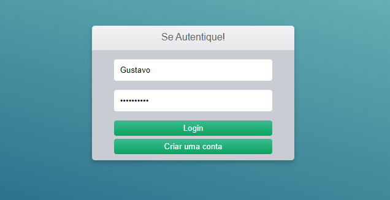
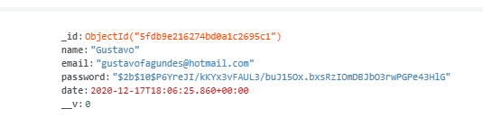
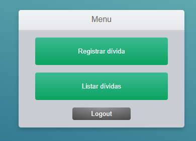
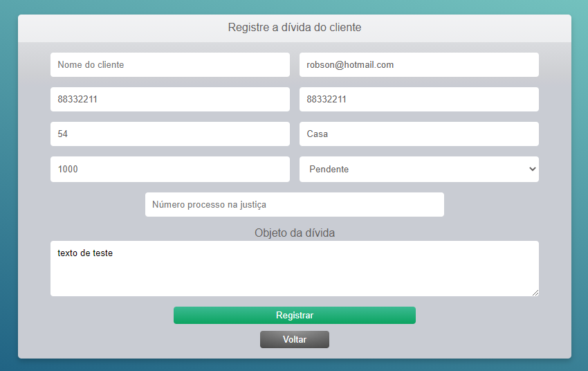
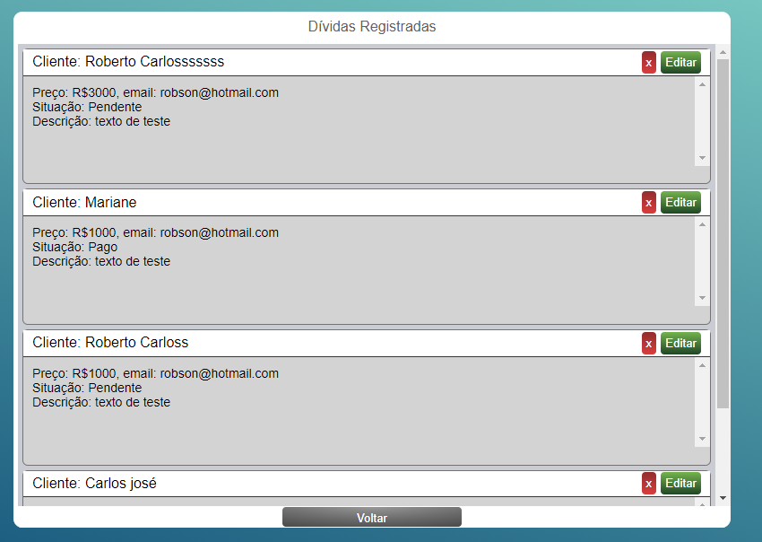
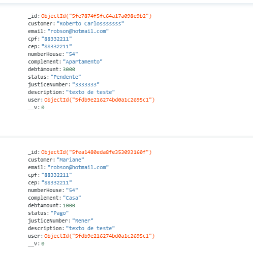

## An API made by Node + MongoDB + HTML, CSS and JS!.

The applications is a debt system, that we create an user, In which the user creates debts for other people, each debt coming from a company that wants to collect that person

We start with our login screen by making request to our API by ajax to ensure that the session starts with our user being able to connect with an account already registered in the database system.

The application is using JWT to ensure the authentication

This is the user that i'm logging in

At the backend, occurrs some validations made by express to the user when he creates an account, as encryption the password, verifying if there's another email registered and if the pasword is strong or weak.

Here we have a stylish and simple menu.

Here we can register the debt and it informations and save all this information to the backend, all the informations is sent to there using the api fetch! as it was done at the login screen

And finally, our debt list that were registered at the form, we can scroll all debts registered and   update the information in each debt or delete. All of theses debts are registered in MongoDB database and the server is responding and requesting to frontend to show theses informations and each user has their number of debts for themselves.

